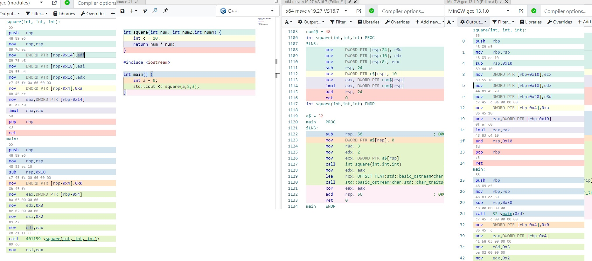

stack-memory-playground
=======================

### Notes
- The address direction (High to low / low to high) is different for linux and Windows

### Tutorials
- [A - Z Nasm Assembly 64Bit Programming - Loop, Stack, prinf, scanf, conditions - YouTube](https://www.youtube.com/watch?v=5eWiz3soaEM)
